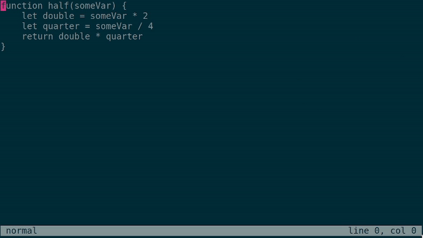

# wr
A small proof-of-concept text editor,
adding multiple cursors
and a modular suckless-like architecture.
Read this [article](https://hhhhhhhhhn.com/writings/a-reflection-on-vim-like-text-editors.html) for more information.

## Features
- It is designed around the basic Vim keybinds.
- It has multiple cursor support,
  but instead of using special keybinds,
  the visual-block mode is replaced by a new mode
  that adds a new cursor instead of moving.
  For example, to add two new cursors down below where you are,
  you would press `<C-v>jj<Esc>`.
- It includes a simple and extensible command system.
- It is written in Go,
  making it easy to program and extend,
  with a quick compilation time of less than half a second.
- It is fast, with instant startup and the ability to perform
  multi-line edits on thousands of lines at a time.
- It is programmed in a functional, modular, and readable style,
  which takes advantage of Go's type system.
  For example, movements are simply functions
  that return a new position from the old one.
  Core components, like the buffer, are hot-swappable
  by implementing the basic interface.
- It uses immutable data structures,
  allowing for a fast and memory-efficient undo tree.
- It has tests for every component,
  which are consistent due to the functional style.
  Also, it is really easy to profile.
- It has just over 1500 lines of code,
  which are neatly divided into different modules.
